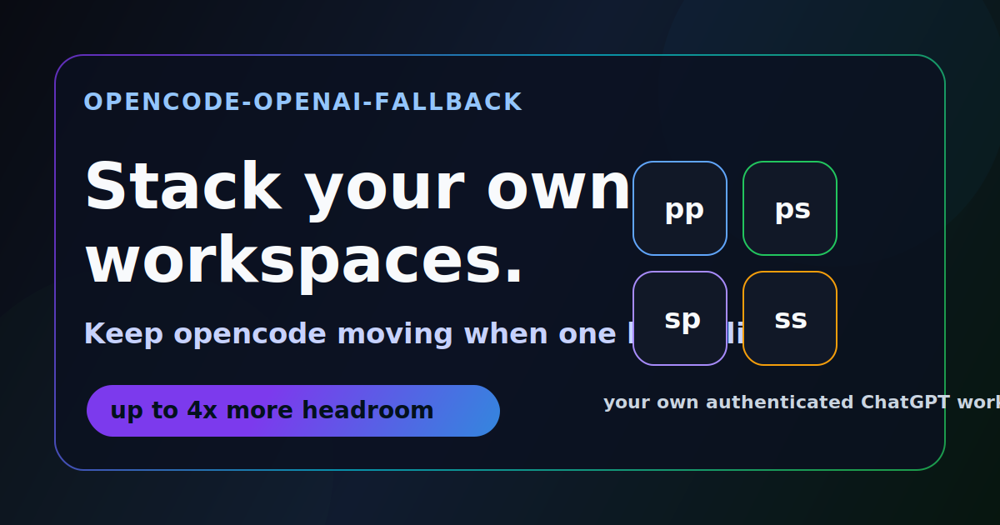

# opencode-openai-fallback

Keep opencode moving when one ChatGPT workspace hits a limit.



If opencode is part of your daily workflow, the failure mode is familiar: one ChatGPT workspace hits a limit and everything stops. `opencode-openai-fallback` gives opencode a clean route across up to four of your own authenticated workspaces.

When one workspace returns a limit-like response, opencode can retry through the next profile instead of making you stop, switch accounts, and rebuild your flow.

```text
pp -> ps -> sp -> ss
```

Built for people who already use opencode with OpenAI ChatGPT auth and have more than one legitimate personal, Plus, Pro, Business, or Team workspace available. It does not create accounts, share tokens, remove provider limits, or promise unlimited usage. Availability and limits vary by account and region.

## Install in one command

Windows PowerShell:

```powershell
irm https://raw.githubusercontent.com/VE5ETA/opencode-openai-fallback/main/install.ps1 | iex
```

The installer copies the fallback plugin and helper script, registers the plugin in your opencode config, and adds the PowerShell shortcuts. If opencode is missing, it tries to install `opencode-ai` with npm, then Scoop, then Chocolatey.

Open a new PowerShell window after installing.

## What you get

- Up to 4x more opencode headroom across your own authenticated workspaces.
- Automatic fallback when one workspace returns a usage-limit, rate-limit, or quota-like response.
- One shared opencode session database, so `resume` still points at the same history.
- Separate auth storage per workspace profile, so tokens are not mixed together.
- Fallback for both the interactive opencode TUI and `opencode run ...`.
- Plain `opencode` support, so your daily command does not need to change.

## The profile map

The short names are intentionally simple. They describe the fallback order and the kind of workspace behind each login.

```text
pp = primary personal
ps = primary shared
sp = secondary personal
ss = secondary shared
```

Default route:

```text
pp -> ps -> sp -> ss
```

You can login to one profile or all four. The fallback only uses profiles that are actually authenticated.

## Quick start

Login to each workspace you want opencode to use:

```powershell
ocai login pp
ocai login ps
ocai login sp
ocai login ss
```

Use the matching browser account and ChatGPT workspace during each login.

Then use opencode normally:

```powershell
opencode
opencode run "fix the tests"
```

Need a specific workspace?

```powershell
ocpp  # primary personal
ocps  # primary shared
ocsp  # secondary personal
ocss  # secondary shared
ocraw # raw opencode.cmd without the wrapper
```

If you do not want plain `opencode` to call the fallback wrapper, install with this command instead:

```powershell
& ([scriptblock]::Create((irm https://raw.githubusercontent.com/VE5ETA/opencode-openai-fallback/main/install.ps1))) -NoOpencodeFunction
```

## Before and after

Before:

- opencode hits `usage limit reached`.
- You stop the session.
- You switch accounts or workspaces manually.
- You restart and hope your session history still lines up.

After:

- opencode starts on `pp`.
- If `pp` hits a limit-like response, the plugin retries with `ps`.
- If needed, it continues through `sp` and `ss`.
- Sessions stay tied to the same `opencode.db`, so `resume` stays useful.

## How it works

The PowerShell helper gives each profile its own OpenAI auth directory:

```text
pp = primary personal
ps = primary shared
sp = secondary personal
ss = secondary shared
```

All profiles point at the same opencode session database:

```text
~/.local/share/opencode/opencode.db
```

The plugin runs inside opencode and watches OpenAI OAuth requests. When it sees a clear usage-limit, rate-limit, or quota-like response, it retries the same request with the next authenticated profile.

For one-shot commands, the wrapper applies the same route to `opencode run ...`.

## Safety boundaries

Use this with your own accounts and workspaces.

Do not publish tokens. Do not copy `auth.json` between machines you do not control. Do not use this to share access with other people.

This is workspace fallback, not unlimited usage. It helps opencode use the authenticated workspaces you already have access to. Account eligibility, availability, and limits vary.

## Verify

From a cloned repo:

```powershell
node .\tests\test-openai-auto-fallback.mjs
powershell -NoLogo -NoProfile -ExecutionPolicy Bypass -File .\tests\test-openai-wrapper.ps1
powershell -NoLogo -NoProfile -ExecutionPolicy Bypass -File .\tests\test-install.ps1
powershell -NoLogo -NoProfile -ExecutionPolicy Bypass -File .\scripts\verify-no-secrets.ps1
```

## Docs

- `docs/setup.md`: installation and login flow.
- `docs/troubleshooting.md`: common failures and fixes.
- `docs/safety-and-positioning.md`: launch wording and boundaries.

## License

MIT
